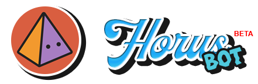

<h1 align="center">
    
</h1>

# Horus Bot
A chat bot for Discord app based off <a href="https://github.com/hydrabolt/discord.js/">discord.js</a>.  
This repository consists of a personal project to develop a BOT in Discord, as a way of learning.
Yes, it's the default tumblr avatar. But it's so cute! 🥺
 
 
Some files and code snippets have been removed to maintain the integrity and security of the project.

# Features:

Under construction  👨‍💻

# Installation

This bot is written to run on top of node.js. Please see https://nodejs.org/en/download/

Once you have NodeJS installed, running `npm install` from the bot directory should install all required packages. If this command prints errors, the bot won't work!

After installing all dependencies, open your terminal and type `node .` to run the bot project.
 
 
Remember to create your application at <a href="https://discord.com/developers/applications">Discord/developer</a>, taking your bot's Token and adding it to `bot.login(yourToken);`

# TODO:

Setup the bot!

# Help

The official bot server on Discord will be available as soon as the initial development is complete.
